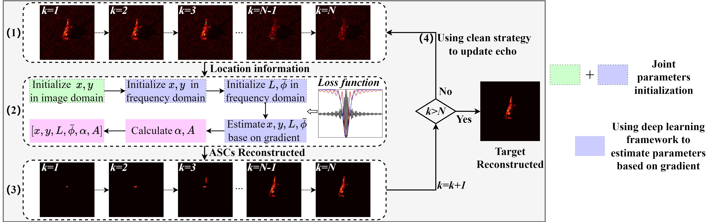

# ASC_extraction

 Our paper, "Efficient Attributed Scattering Center Extraction Using Gradient-Based Optimization for SAR Image", has been accepted for publication in **IEEE Antennas and Wireless Propagation Letters (AWPL)**.
 (https://ieeexplore.ieee.org/document/11126995)

This repository contains the official PyTorch implementation of our work. If you find our work useful in your research, please consider giving this repository a star ⭐.

## Overview


We introduce a fully gradient-based optimization Attributed Scattering Centers (ASCs) extrection method. By leveraging a novel **joint image-frequency domain initialization** and using gradient-based optimization in PyTorch, 
our approach significantly enhances the extraction speed. For the T72 target, the estimation of 40 ASCs can be completed in approximately 10 seconds.


## Installation

 **Install dependencies:**
 > * PyTorch == 1.9.1 （supports complex number operations.）
 > * scipy
 > * hdf5storage


## Usage

1.  **Data Preparation:**
    Place your SAR echo data files into the `./data/` directory. The input should be `.mat` files.

    For the MSTAR/SAMPLE datasets, echo signals should be obtained by performing zero-padding removal and Taylor window processing, and stored in variable `specRmZeroAndWin`.

2.  **Run Extraction:**
    Execute the main script to start the ASC extraction process.
    ```bash
    python ASC_extract_multi_file_loop_zh.py
    ```
 3.  **Result:**
    The extracted results are saved in the `./result/` directory.

If you find our work useful for your research, we would appreciate you citing our paper:


## Citation

```bibtex
@ARTICLE{11126995,
  author={Luan, Jiawei and Huang, Xuejun and Ding, Jinshan},
  journal={IEEE Antennas and Wireless Propagation Letters}, 
  title={Efficient Attributed Scattering Center Extraction Using Gradient-Based Optimization for SAR Image}, 
  year={2025},
  volume={},
  number={},
  pages={1-5},
  doi={10.1109/LAWP.2025.3599562}}


